# H1   第一次Linux作业

By:欧锦松  网安一班  学号：2020212063029

### 实验环境：

- 宿主机：Windows 10
- 虚拟机:   Ubuntu 20.04.3 LTS

### 实验要求：

1. 调查并记录实验环境的如下信息：
   - 当前 Linux 发行版基本信息
   - 当前 Linux 内核版本信息
2. Virtualbox 安装完 Ubuntu 之后新添加的网卡如何实现系统开机自动启用和自动获取 IP？
3. 如何使用 `scp` 在「虚拟机和宿主机之间」、「本机和远程 Linux 系统之间」传输文件？
4. 如何配置 SSH 免密登录？

### 实验过程以及结果：

##### 调查并记录实验环境的如下信息：

- 当前 Linux 发行版基本信息

  使用ssh分别登录本地虚拟机以及阿里云云电脑进行操作,

  分别使用命令

  ```shell
  lsb_release -a
  
  cat /etc/issue
  
  cat /etc/os-release
  ```

  结果如下：

  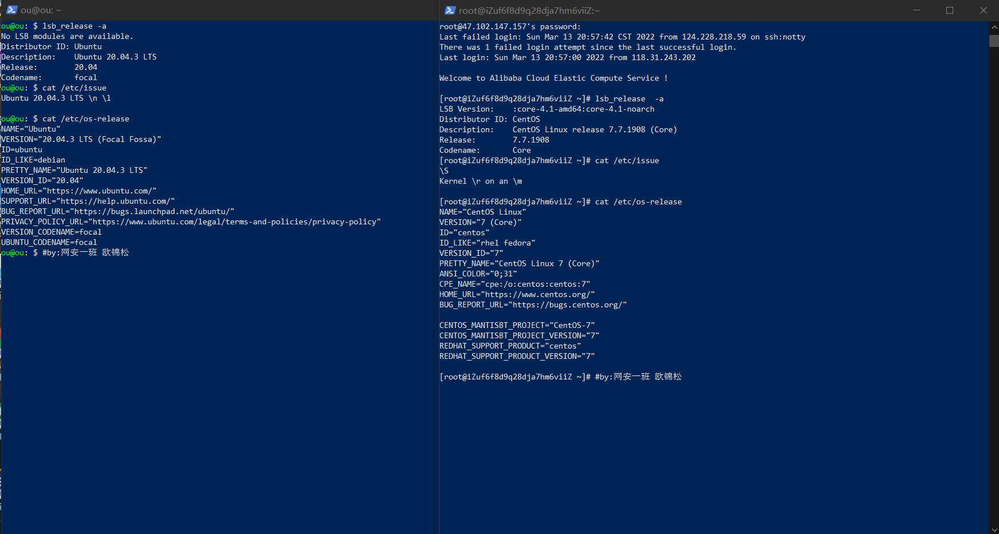

- 当前 Linux 内核版本信息

  分别使用命令

  ```shell
  uname -a
  
  cat /proc/version
  ```

  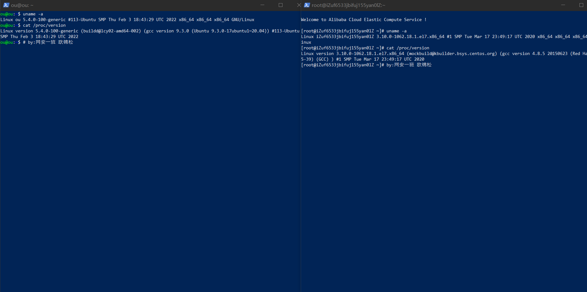


##### Virtualbox 安装完 Ubuntu 之后新添加的网卡如何实现系统开机自动启用和自动获取 IP？

Virtualbox网卡设置：

使用命令

```shell
ip a
```

查看网卡信息

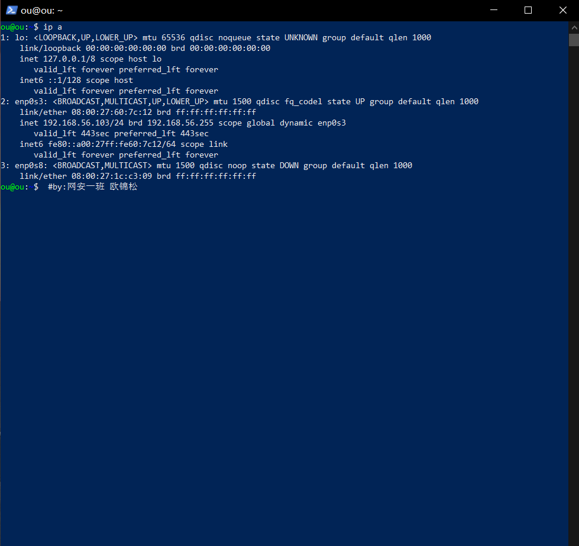


##### 如何使用 `scp` 在「虚拟机和宿主机之间」、「本机和远程 Linux 系统之间」传输文件？

###### 首先在虚拟机中创建文件test

使用命令创建文件：

```shell
echo "helloworld" > test
```

完整命令：

```shell
ou@ou:~$ echo "helloworld" > test
ou@ou:~$ cat test
helloworld
ou@ou:~$ pwd
/home/ou
ou@ou:~$
```

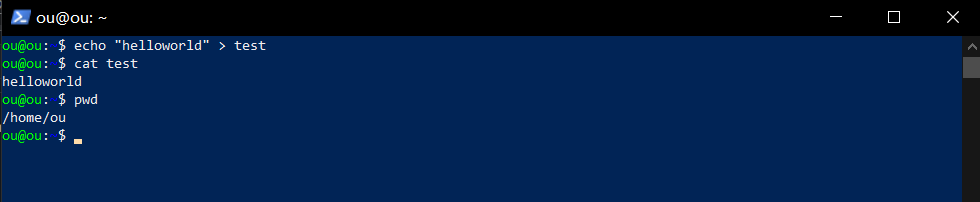

###### 之后在宿主机中将文件传输过来

```shell
PS C:\Users\ou\Desktop> scp -r ou@192.168.56.103:/home/ou/test ./
ou@192.168.56.103's password:
test                                                                                  100%   11    11.0KB/s   00:00
PS C:\Users\ou\Desktop> date

2022年3月13日 21:24:30


PS C:\Users\ou\Desktop>
```

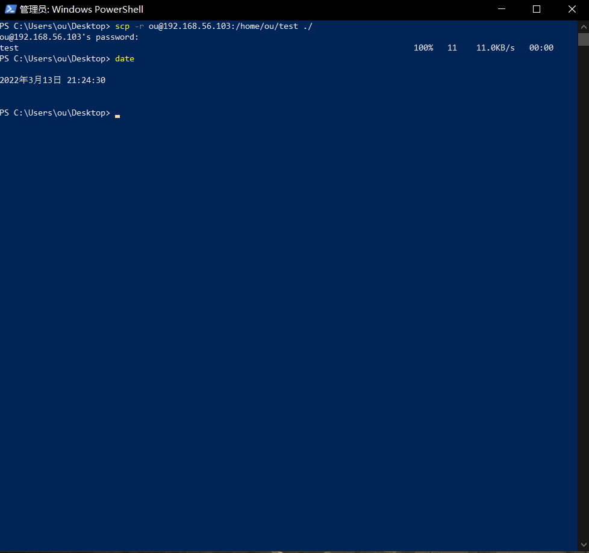

此时桌面上新增文件：

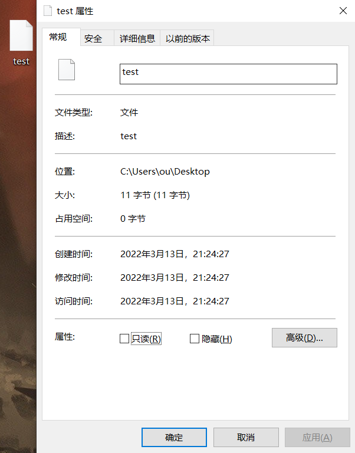

###### 将文件由宿主机传输至虚拟机

将desktop.ini传输至虚拟机中：

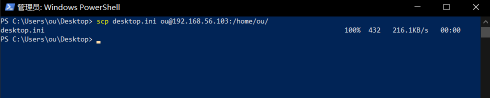

同时在虚拟机中查看：

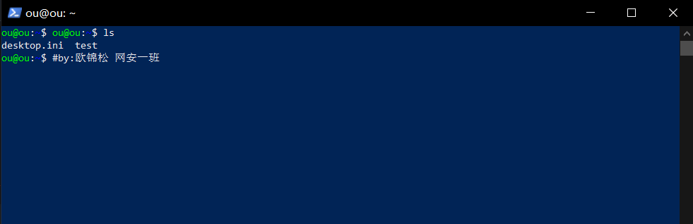


##### 如何配置 SSH 免密登录？

首先在git bash中使用 ssh-keygen.exe配置密钥：

```shell
ou@LAPTOP-PDIF605N MINGW64 ~/Desktop
$ ssh-keygen.exe
Generating public/private rsa key pair.
Enter file in which to save the key (/c/Users/ou/.ssh/id_rsa):
Enter passphrase (empty for no passphrase):
Enter same passphrase again:
Your identification has been saved in /c/Users/ou/.ssh/id_rsa
Your public key has been saved in /c/Users/ou/.ssh/id_rsa.pub
The key fingerprint is:
SHA256:+PdQJL1Cm5+bl2H0PQ/QMs1rxo2O/p3QgKAyCDifY4Q ou@LAPTOP-PDIF605N
The key's randomart image is:
+---[RSA 3072]----+
|                 |
|..         .     |
|E..      .o o+   |
| +...  ....==.=  |
|  =. o..S +.oB =.|
| . .  o.   + .%.+|
|        . o oB =o|
|         . o.o=.o|
|           .=o...|
+----[SHA256]-----+
```

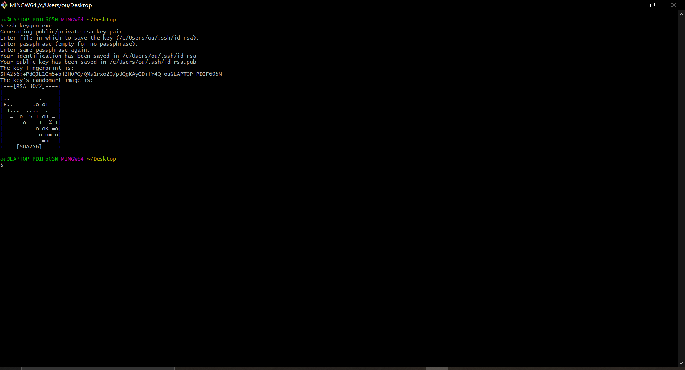

再使用

```shell
ssh-copy-id -i ~/.ssh/id_rsa.pub ou@192.168.56.103
```

配置免密登录

```shell
ou@LAPTOP-PDIF605N MINGW64 ~/Desktop
$ ssh-copy-id -i ~/.ssh/id_rsa.pub ou@192.168.56.103
/usr/bin/ssh-copy-id: INFO: Source of key(s) to be installed: "/c/Users/ou/.ssh/id_rsa.pub"
/usr/bin/ssh-copy-id: INFO: attempting to log in with the new key(s), to filter out any that are already installed
/usr/bin/ssh-copy-id: INFO: 1 key(s) remain to be installed -- if you are prompted now it is to install the new keys
ou@192.168.56.103's password:

Number of key(s) added: 1

Now try logging into the machine, with:   "ssh 'ou@192.168.56.103'"
and check to make sure that only the key(s) you wanted were added.
```

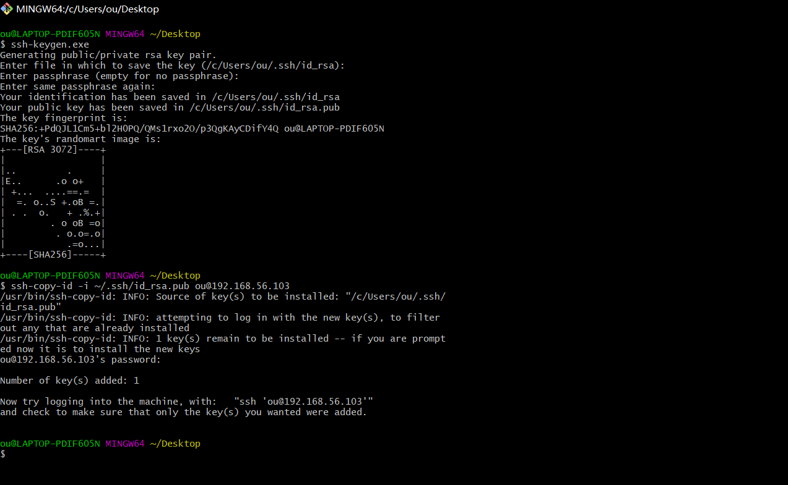

再次使用ssh登录Linux

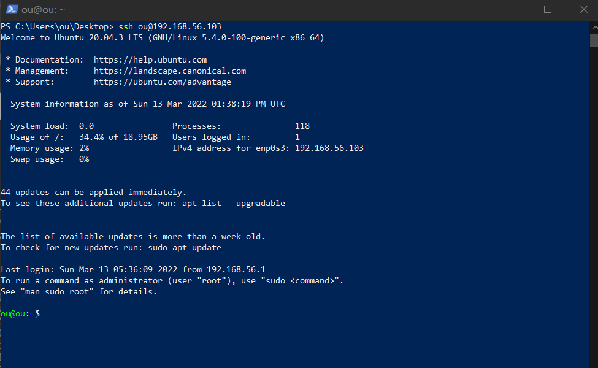

此时无需输入密码，免密登录配置成功。

### 实验中遇到的问题以及解决方法

1.在使用ssh登录Linux的时候，ip地址错误


原因为Virtualbox中网卡只有NAT:


添加host-only网卡后可以正常登录


