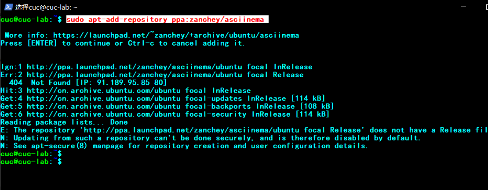
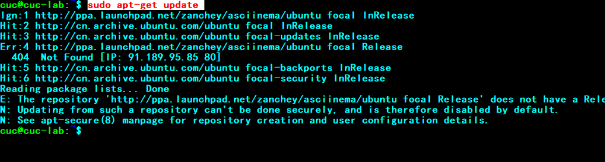
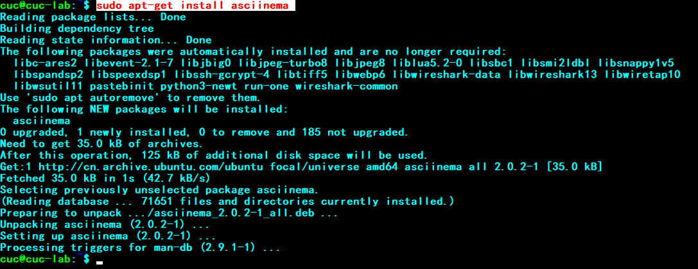
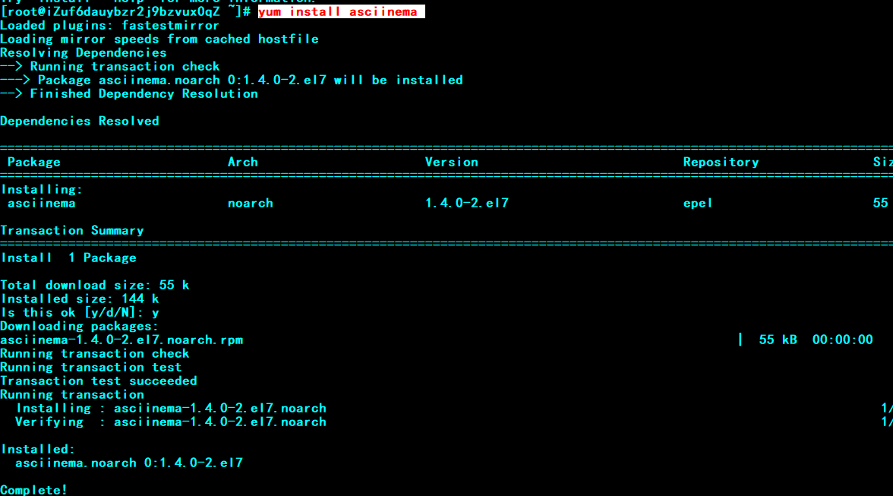
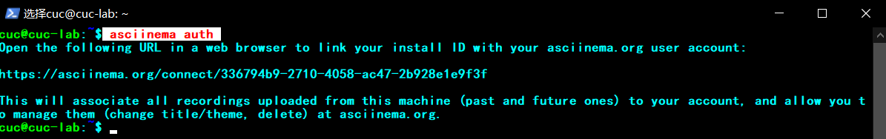

## H2 第二次Linux作业

by:欧锦松 

### 作业要求：

- 使用表格方式记录至少 2 个不同 Linux 发行版本上以下信息的获取方法，使用 [asciinema](https://asciinema.org/) 录屏方式「分段」记录相关信息的获取过程和结果
- 【软件包管理】在目标发行版上安装 `tmux` 和 `tshark` ；查看这 2 个软件被安装到哪些路径；卸载 `tshark` ；验证 `tshark` 卸载结果

- 【文件管理】复制以下shell代码到终端运行，在目标 Linux 发行版系统中构造测试数据集，然后回答以下问题：
  - 找到 `/tmp` 目录及其所有子目录下，文件名包含 `666` 的所有文件
  - 找到 `/tmp` 目录及其所有子目录下，文件内容包含 `666` 的所有文件

```shell
cd /tmp && for i in $(seq 0 1024);do dir="test-$RANDOM";mkdir "$dir";echo "$RANDOM" > "$dir/$dir-$RANDOM";done
```

- 【文件压缩与解压缩】练习课件中 [文件压缩与解压缩](https://c4pr1c3.github.io/LinuxSysAdmin/chap0x02.md.html#/12/1) 一节所有提到的压缩与解压缩命令的使用方法
- 【跟练】 [子进程管理实验](https://asciinema.org/a/f3ux5ogwbxwo2q0wxxd0hmn54)
- 【硬件信息获取】目标系统的 CPU、内存大小、硬盘数量与硬盘容量

### 完成过程以及结果：

在本地版和CentOS版安装`asciinema`：

本地版安装命令：

```shell
sudo apt-add-repository ppa:zanchey/asciinema
sudo apt-get update
sudo apt-get install asciinema
```








CentOS版安装命令：

```shell
yum install asciinema
```




最后均使用以下命令获取链接

```shell
asciinema auth
```




------

### `asciinema`视频：

|                  | 本地版本                                                     | CentOS版本                                                   |
| ---------------- | ------------------------------------------------------------ | ------------------------------------------------------------ |
| **软件包管理**   | [](https://asciinema.org/a/478983) | [](https://asciinema.org/a/479028) |
| **文件管理**     | [](https://asciinema.org/a/478995) | [](https://asciinema.org/a/479031) |
| **文件解压缩**   | [](https://asciinema.org/a/478999) | [](https://asciinema.org/a/479049) |
| **子进程管理**   | [](https://asciinema.org/a/479004) | [](https://asciinema.org/a/479052) |
| **硬件信息获取** | [](https://asciinema.org/a/479006) | [](https://asciinema.org/a/479054) |

------

### 实验中遇到的问题以及解决方法：

1.在本地版本下载`tshark`的时候出现`E:Failed to fetch`问题

解决方法：打开DNS网关，输入以下指令：

```shell
sudo vim /etc/resolv.conf
添加 nameserver 223.5.5.5以及nameserver 223.6.6.6
sudo apt-get update
```

最后问题得到解决。

参考资料：https://blog.csdn.net/Davidietop/article/details/88909622

2.CentOS中安装`tshark`

在视频中已经演示。

参考资料：https://blog.csdn.net/xzm5708796/article/details/86487555

3.CentOS中安装7z

参考资料：https://blog.csdn.net/default7/article/details/96479015

4.Ubuntu中解压缩命令

参考资料1：https://blog.csdn.net/songbinxu/article/details/80435665

参考资料2：https://www.jianshu.com/p/60208a01c8ef