## H4_Linux第四次作业

### 实验环境：

- 虚拟机：Ubuntu 20.04.2 LTS
- 宿主机：Windows 10

### 实验目标：

##### 任务一：用bash编写一个图片批处理脚本，实现以下功能：

- [x] 支持命令行参数方式使用不同功能
- [x] 支持对指定目录下所有支持格式的图片文件进行批处理
- [x] 支持以下常见图片批处理功能的单独使用或组合使用
  - [x] 支持对jpeg格式图片进行图片质量压缩
  - [x] 支持对jpeg/png/svg格式图片在保持原始宽高比的前提下压缩分辨率
  - [x] 支持对图片批量添加自定义文本水印
  - [x] 支持批量重命名（统一添加文件名前缀或后缀，不影响原始文件扩展名）
  - [x] 支持将png/svg图片统一转换为jpg格式图片

[task1.sh](./code/task1.sh)

##### 任务二：用bash编写一个文本批处理脚本，对以下附件分别进行批量处理完成相应的数据统计任务：

[2014世界杯运动员数据](https://c4pr1c3.github.io/LinuxSysAdmin/exp/chap0x04/worldcupplayerinfo.tsv)

- [x] 统计不同年龄区间范围（20岁以下、[20-30]、30岁以上）的球员**数量**、**百分比**
- [x] 统计不同场上位置的球员**数量**、**百分比**
- [x] 名字最长的球员是谁？名字最短的球员是谁？
- [x] 年龄最大的球员是谁？年龄最小的球员是谁？

[task2.sh](./code/task2.sh)

[任务二数据](./report/task2_data.md)

##### 任务三：用bash编写一个文本批处理脚本，对以下附件分别进行批量处理完成相应的数据统计任务：

[Web服务器访问日志](https://c4pr1c3.github.io/LinuxSysAdmin/exp/chap0x04/web_log.tsv.7z)

- [x] 统计访问来源主机TOP 100和分别对应出现的总次数
- [x] 统计访问来源主机TOP 100 IP和分别对应出现的总次数
- [x] 统计最频繁被访问的URL TOP 100
- [x] 统计不同响应状态码的出现次数和对应百分比
- [x] 分别统计不同4XX状态码对应的TOP 10 URL和对应出现的总次数
- [x] 给定URL输出TOP 100访问来源主机

[task3.sh](./code/task3.sh)

[任务三数据](./report/task3_data.md)

### 实验结果：

- #### Shellcheck

  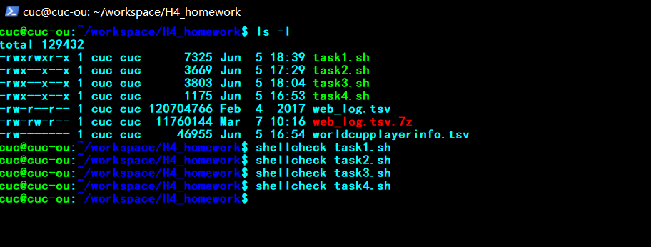

- #### Task1:用bash编写一个图片批处理脚本，实现以下功能:

  - 支持命令行参数方式使用不同功能

    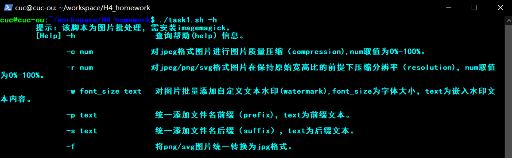

  - 支持对指定目录下所有支持格式的图片文件进行批处理(举例批量添加前缀)

    - 添加前缀前：

      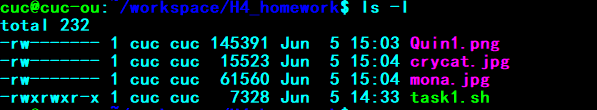

    - 统一添加前缀`ou`：

      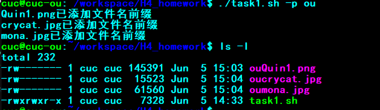

    

  - 支持对jpeg格式图片进行图片质量压缩

    - 压缩前：

      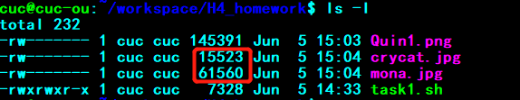

    - 压缩后：

      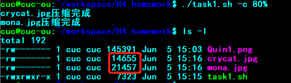

    

  -  支持对jpeg/png/svg格式图片在保持原始宽高比的前提下压缩分辨率

    - 压缩分辨率前：

      

    - 压缩分辨率后：

      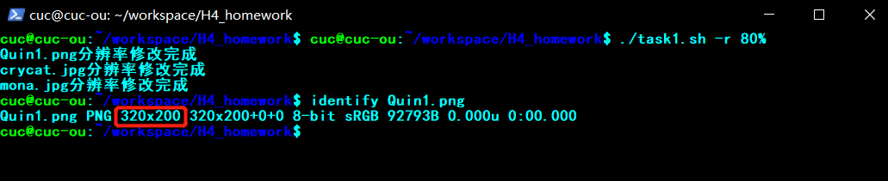

    

  - 支持对图片批量添加自定义文本水印

    - 添加自定义文本水印前：

      |  |  |  |
      | ------------------------------------------- | ------------------------- | --------------------------- |

      

    - 添加自定义文本水印后：

      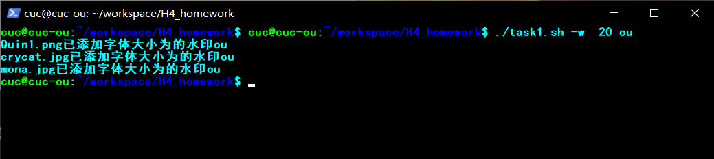

      |  |  |  |
      | ------------------------------ | ----------------------------- | ------------------------------- |

      

    

  - 支持批量重命名（统一添加文件名前缀或后缀，不影响原始文件扩展名）

    - 添加前缀已在批处理演示

    - 添加后缀前：

      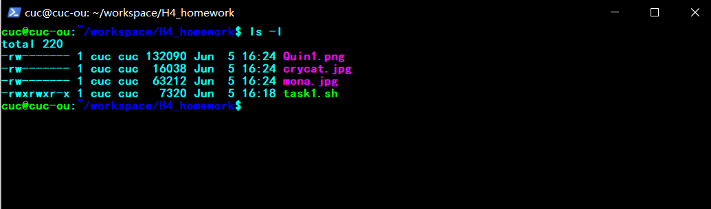

    - 添加后缀后：

      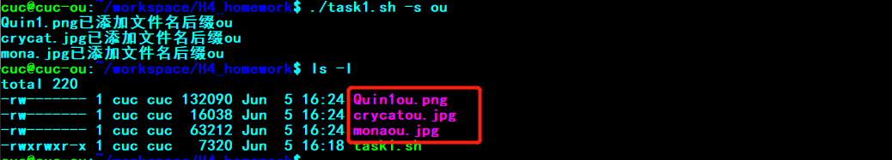

      

    

  - 支持将png/svg图片统一转换为jpg格式图片

    - 转换前：

      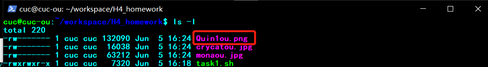

    - 转换后

      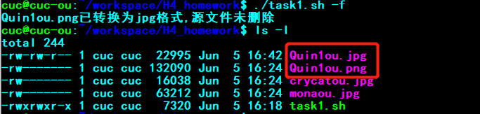

    

    

- #### Task2:用bash编写一个文本批处理脚本，对以下附件分别进行批量处理完成相应的数据统计任务：

  - 统计不同年龄区间范围（20岁以下、[20-30]、30岁以上）的球员**数量**、**百分比**

    

  - 统计不同场上位置的球员**数量**、**百分比**

    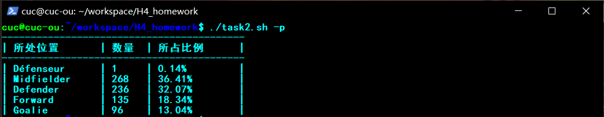

  - 名字最长的球员是谁？名字最短的球员是谁？

    

  - 年龄最大的球员是谁？年龄最小的球员是谁？

    

    

- #### Task3:用bash编写一个文本批处理脚本，对以下附件分别进行批量处理完成相应的数据统计任务：

  - 统计访问来源主机TOP 100和分别对应出现的总次数

    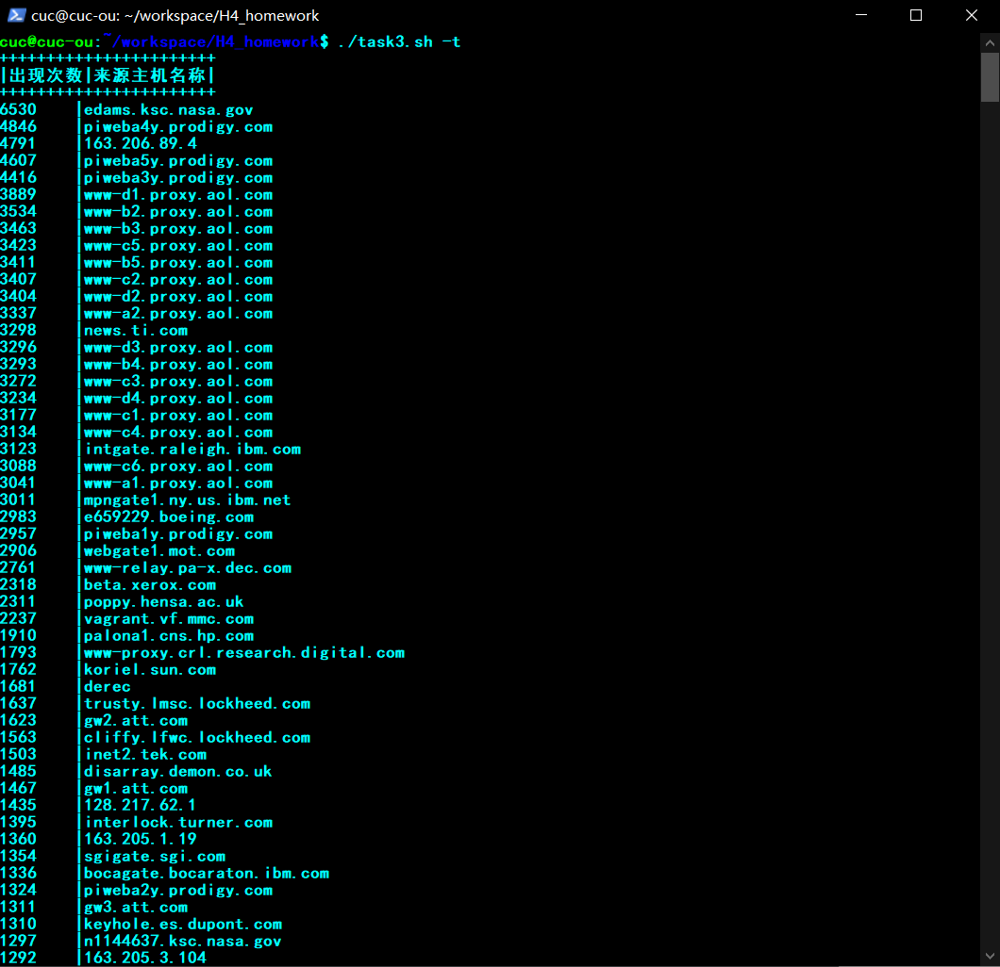

  - 统计访问来源主机TOP 100 IP和分别对应出现的总次数

    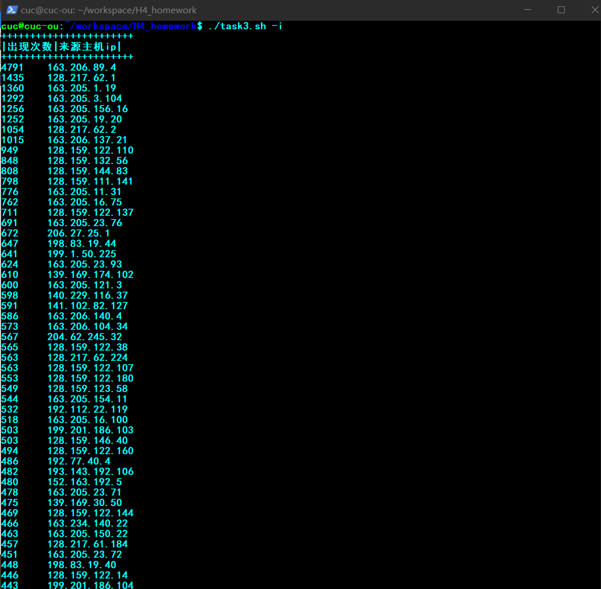

  - 统计最频繁被访问的URL TOP 100

    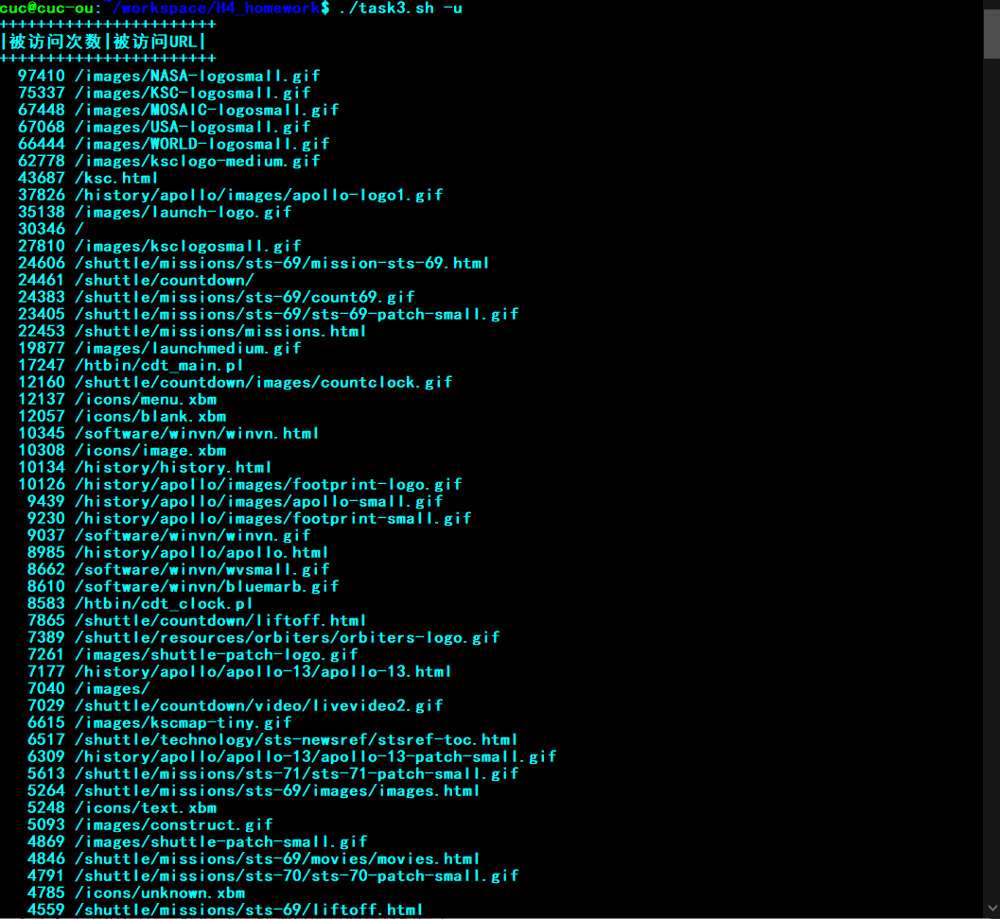

  - 统计不同响应状态码的出现次数和对应百分比

    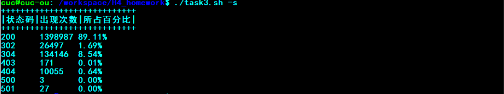

  - 分别统计不同4XX状态码对应的TOP 10 URL和对应出现的总次数

    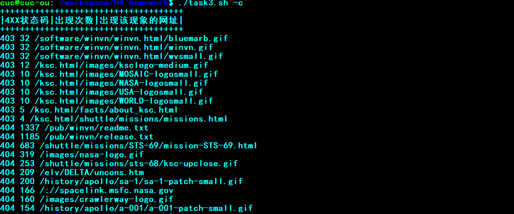

  - 给定URL输出TOP 100访问来源主机

    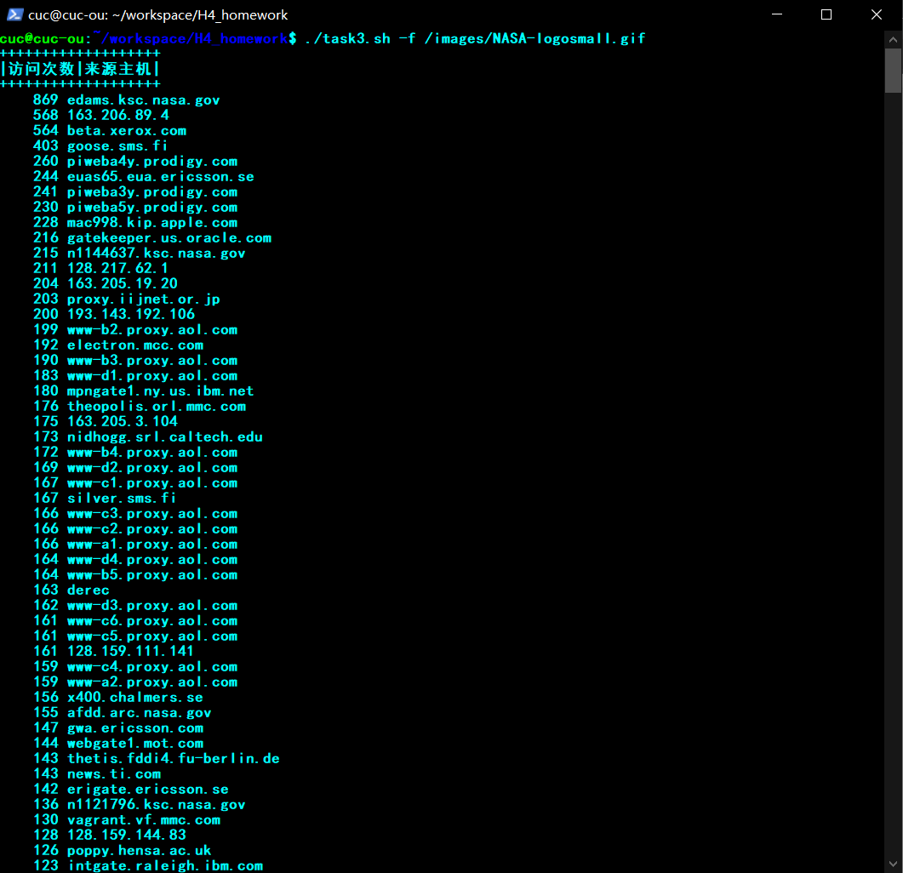

    

- #### Task4:求两个整数的最大公因数:

  [task4.sh](./code/task4.sh)

  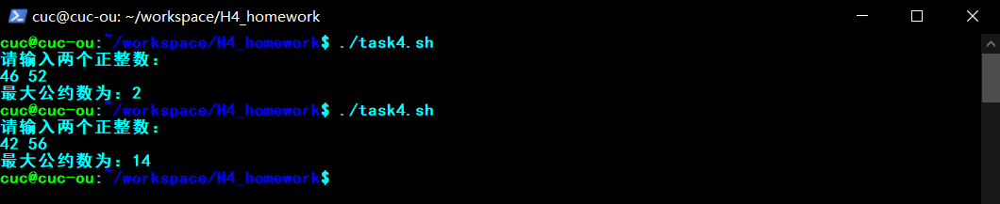

### 参考链接：

- [Linux系统与网络管理 黄玮]((https://c4pr1c3.github.io/LinuxSysAdmin/chap0x04.md.html#/title-slide))
- [2021-linux-public-kal1x](https://github.com/CUCCS/2021-linux-public-kal1x/tree/chap0x04)
- [Linux之convert命令的使用](https://blog.csdn.net/u014743238/article/details/104636812)
- [Bash Shell编程入门](https://www.jianshu.com/p/e1c8e5bfa45e)

