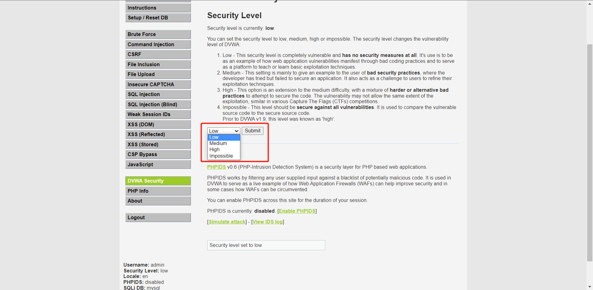
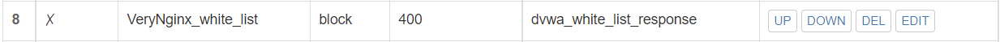
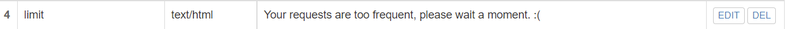
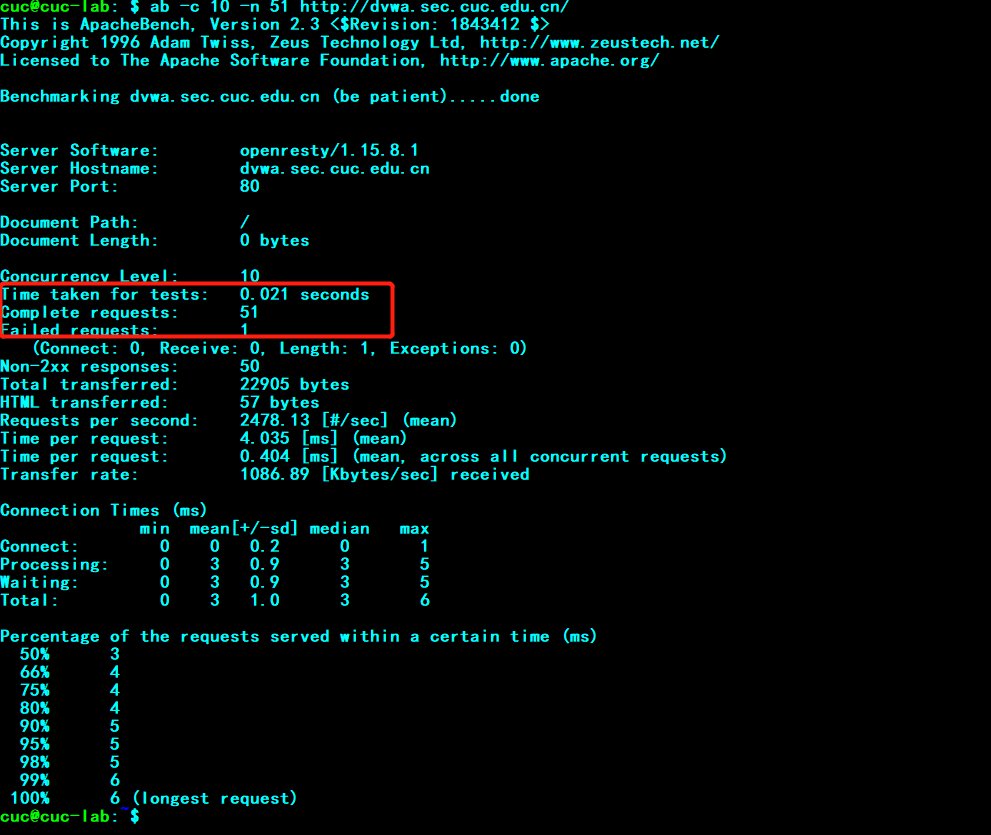
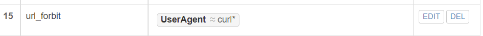

# H5_Linux第五次作业

### 实验环境：

- 虚拟机：Ubuntu 20.04.2 LTS
- 宿主机：Windows 10


### 实验目标：

#### 基本要求

- [x] 在一台主机（虚拟机）上同时配置 Nginx 和 VeryNginx
  - [x] VeryNginx 作为本次实验的 Web App 的反向代理服务器和 WAF
  - [x] PHP-FPM 进程的反向代理配置在 nginx 服务器上，VeryNginx 服务器不直接配置 Web 站点服务
- [x] 使用 [Wordpress](https://wordpress.org/) 搭建的站点对外提供访问的地址为： http://wp.sec.cuc.edu.cn
- [x] 使用 [Damn Vulnerable Web Application (DVWA)](http://www.dvwa.co.uk/) 搭建的站点对外提供访问的地址为： http://dvwa.sec.cuc.edu.cn


#### 安全加固要求

- [x] 使用IP地址方式均无法访问上述任意站点，并向访客展示自定义的**友好错误提示信息页面 -1**
- [x] [Damn Vulnerable Web Application (DVWA)](http://www.dvwa.co.uk/) 只允许白名单上的访客来源IP，其他来源的IP访问均向访客展示自定义的**友好错误提示信息页面 -2**
- [x] 在不升级 Wordpress 版本的情况下，通过定制 [VeryNginx](https://github.com/alexazhou/VeryNginx) 的访问控制策略规则，**热**修复 [WordPress < 4.7.1 - Username Enumeration](https://www.exploit-db.com/exploits/41497/)
- [x] 通过配置 [VeryNginx](https://github.com/alexazhou/VeryNginx) 的 Filter 规则实现对 [Damn Vulnerable Web Application (DVWA)](http://www.dvwa.co.uk/) 的 SQL 注入实验在低安全等级条件下进行防护


#### VeryNginx 配置要求

- [x] [VeryNginx](https://github.com/alexazhou/VeryNginx) 的 Web 管理页面仅允许白名单上的访客来源 IP，其他来源的 IP 访问均向访客展示自定义的**友好错误提示信息页面 -3**
- [x] 通过定制 VeryNginx 的访问控制策略规则实现：
  - [x] 限制 DVWA 站点的单 IP 访问速率为每秒请求数 < 50
  - [x] 限制 Wordpress 站点的单 IP 访问速率为每秒请求数 < 20
  - [x] 超过访问频率限制的请求直接返回自定义**错误提示信息页面 -4**
  - [x] 禁止 curl 访问


### 实验结果

#### 1.实验前准备

- 下载Nginx

  ```bash
  sudo apt update && sudo apt install nginx -y
  ```

  

- 下载VeryNginx

  ```bash
  git clone https://github.com/alexazhou/VeryNginx.git
  
  sudo python3 install.py install
  ```

  

- 下载WordPress

  ```bash
  sudo wget https://wordpress.org/wordpress-4.7.zip
  ##未安装解压软件需安装解压软件，安装完成之后进行解压
  ```

  

- 下载DVWA

  ```bash
  git clone https://github.com/digininja/DVWA.git
  ```

  

#### 2.配置文件

##### 2.1 更改宿主机和虚拟机host文件


##### 2.2 配置Nginx

2.2.1 修改默认端口为8000


2.2.2 在宿主机浏览器中输入：`192.168.56.101:8000`：


该页面说明Nginx安装成功。


##### 2.3 配置WordPress

2.3.1 在Mysql中为WordPress新建一个数据库

```bash
sudo mysql

create database wordpress DEFAULT CHARACTER SET utf8 COLLATE utf8_unicode_ci; ##创建数据库

create user 'ou'@'localhost' IDENTIFIED BY 'cuc'; ##新建用户

grant all on wordpress.* to 'ou'@'localhost'; ##为新建用户授权

flush privileges;
exit;

```


2.3.2 配置php文件：


2.3.3 配置端口以及服务器文件:

```bash
sudo vim /etc/nginx/sites-available/wp.conf ##创建服务器配置文件
```


2.3.4 通过 http://wp.sec.cuc.edu.cn:8001/wordpress/ 访问WordPress


##### 2.4 配置DVWA

2.4.1 与配置WordPress一样新建一个数据库

```bash
sudo mysql

create database wordpress DEFAULT CHARACTER SET utf8 COLLATE utf8_unicode_ci; ##创建数据库

create user 'ou_dvwa'@'localhost' IDENTIFIED BY 'cuc'; ##新建用户

grant all on wordpress.* to 'ou_dvwa'@'localhost'; ##为新建用户授权

flush privileges;
exit;

```


2.4.2 配置php文件：


2.4.3 配置端口以及服务器文件:

```bash
sudo vim /etc/nginx/sites-available/dvwa.conf ##创建服务器配置文件
```


2.4.4 通过http://dvwa.sec.cuc.edu.cn:8002/访问DVWA


2.4.5 将允许url访问开启


2.4.6 配置完成后的DVWA页面


##### 2.5 配置VeryNginx

启动服务后访问http://vn.sec.cuc.edu.cn/verynginx/index.html 

```bash
sudo /opt/verynginx/openresty/nginx/sbin/nginx
## 启动服务
```


#### 3.PHP-FPM 进程的反向代理配置

3.1 配置Matcher规则


3.2 设置Proxy Pass


3.3 变更保存后可以直接通过 http://dvwa.sec.cuc.edu.cn/ 和 http://wp.sec.cuc.edu.cn/wordpress/ 访问DVWA和WordPress


#### 4.安全加固要求

##### 4.1 使用IP地址方式均无法访问上述任意站点，并向访客展示自定义的**友好错误提示信息页面 -1**

4.1.1 配置matcher


4.1.2 配置Response


4.1.3 添加到Filter后测试效果：


##### 4.2 [Damn Vulnerable Web Application (DVWA)](http://www.dvwa.co.uk/) 只允许白名单上的访客来源IP，其他来源的IP访问均向访客展示自定义的**友好错误提示信息页面 -2**

4.2.1 配置matcher


4.2.2 配置Response


4.2.3 添加到Filter后测试效果：


##### 4.3 在不升级 Wordpress 版本的情况下，通过定制 [VeryNginx](https://github.com/alexazhou/VeryNginx) 的访问控制策略规则，**热**修复 [WordPress < 4.7.1 - Username Enumeration](https://www.exploit-db.com/exploits/41497/)

4.3.1 漏洞重现

```bash
sudo vim err.php
##创建err.php文件

#!usr/bin/php
<?php
header ('Content-type: text/html; charset=UTF-8');
$url= "http://wp.sec.cuc.edu.cn//";
$payload="wp-json/wp/v2/users/";
$urli = file_get_contents($url.$payload);
$json = json_decode($urli, true);
if($json){
echo "*-----------------------------*\n";
foreach($json as $users){
echo "[*] ID : |" .$users['id'] ."|\n";
echo "[*] Name: |" .$users['name'] ."|\n";
echo "[*] User :|" .$users['slug'] ."|\n";
echo "\n";
}echo "*-----------------------------*";}
else{echo "[*] No user";}
?>
##写入脚本文件

sudo php err.php
```


4.3.2 在VeryNginx中定制访问控制策略

配置matcher


添加到Filter


##### 4.4  通过配置 [VeryNginx](https://github.com/alexazhou/VeryNginx) 的 Filter 规则实现对 [Damn Vulnerable Web Application (DVWA)](http://www.dvwa.co.uk/) 的 SQL 注入实验在低安全等级条件下进行防护

4.4.1 首先要将DVWA中的安全等级设置成low




4.4.2 配置matcher


#### 5.VeryNginx 配置要求

##### 5.1 [VeryNginx](https://github.com/alexazhou/VeryNginx) 的 Web 管理页面仅允许白名单上的访客来源 IP，其他来源的 IP 访问均向访客展示自定义的**友好错误提示信息页面 -3**

5.1.1 配置matcher


5.1.2 配置Filter




5.1.3 配置完成后的效果


##### 5.2 限制 DVWA 站点的单 IP 访问速率为每秒请求数 < 50, Wordpress 站点的单 IP 访问速率为每秒请求数 < 20, 超过访问频率限制的请求直接返回自定义**错误提示信息页面 -4**

5.2.1 在 Frequency Limit中配置规则


5.2.2 配置Response




5.2.3 WordPress测试效果：21次请求，1次请求失败


5.2.4 DVWA测试效果：51次请求，1次请求失败




##### 5.3 禁止 curl 访问

5.3.1 配置matcher




5.3.2 配置Response


5.3.3 添加到Filter后测试效果：


### 遇到的问题以及解决方法

- 实验过程中无法打开配置的网页，在询问同学之后发现需要关掉科学上网。

- 在VeryNginx第一次配置反向代理时，出现可以正常通过链接访问WordPress但是访问DVWA时会跳转到OpenResty。在重启Nginx进程后问题解决。

- 进行VeryNginx白名单实验时，由于该网站只能从宿主机和虚拟机上访问，所以屏蔽了自己的IP地址。随后修改VeryNginx配置文件成功解锁

  


### 参考资料

- [VeryNginx]([VeryNginx/readme_zh.md at master · alexazhou/VeryNginx · GitHub](https://github.com/alexazhou/VeryNginx/blob/master/readme_zh.md))
- [Ubuntu安装wordpress教程](https://blog.csdn.net/liuyan1234/article/details/107413670)
- [nginx配置说明以及VeryNginx使用](https://blog.csdn.net/weixin_40803329/article/details/101446194)

